Pengolahan CItra DIgital :

# Deteksi Penyakit Hati/Liver dengan Segmentasi Image Processing 

## **1. Pendahuluan**
Hati (liver) merupakan salah satu organ vital dalam tubuh manusia yang berperan penting dalam metabolisme, detoksifikasi, dan penyimpanan nutrisi. Gangguan pada hati, seperti hepatitis, sirosis, dan kanker hati, dapat berdampak serius terhadap kesehatan dan bahkan berujung pada komplikasi fatal jika tidak terdeteksi dan ditangani sejak dini. Oleh karena itu, deteksi dini penyakit hati menjadi krusial dalam upaya pencegahan dan pengobatan yang efektif.  

Dalam bidang medis, teknologi pencitraan telah menjadi alat utama dalam mendiagnosis berbagai penyakit hati. Beberapa teknik pencitraan medis yang umum digunakan meliputi ultrasonografi (USG), computed tomography (CT), dan magnetic resonance imaging (MRI). Namun, interpretasi gambar medis secara manual oleh tenaga medis sering kali membutuhkan waktu yang lama dan dapat menghasilkan variasi subjektif antar-pemeriksa. Untuk meningkatkan akurasi dan efisiensi dalam deteksi penyakit hati, pendekatan berbasis image processing dan segmentasi citra telah dikembangkan.  

Segmentasi citra dalam pemrosesan gambar medis bertujuan untuk memisahkan area tertentu dari gambar, seperti jaringan hati, guna mengidentifikasi kelainan dengan lebih akurat. Teknik ini memanfaatkan algoritma komputasi untuk mengekstraksi fitur penting dari gambar medis, sehingga dapat membantu dalam mendeteksi adanya lesi, fibrosis, atau perubahan morfologi pada hati. Berbagai metode segmentasi telah dikembangkan, termasuk teknik berbasis ambang batas (thresholding), region growing, edge detection, serta pendekatan berbasis kecerdasan buatan seperti deep learning.  

Dengan kemajuan teknologi image processing, deteksi penyakit hati dapat dilakukan secara lebih cepat, akurat, dan objektif. Hal ini berpotensi meningkatkan kualitas diagnosis serta mendukung pengambilan keputusan medis yang lebih baik. Oleh karena itu, penelitian dan pengembangan dalam bidang segmentasi citra untuk deteksi penyakit hati menjadi aspek yang sangat penting dalam inovasi medis modern.

Beberapa penelitian sebelumnya telah berfokus pada deteksi penyakit hati menggunakan teknik pengolahan citra. Misalnya, penelitian oleh Smith et al. menggunakan metode segmentasi berbasis thresholding dan hanya mencapai akurasi 65% (Saravanan et al., 2024). Johnson dan Lee menerapkan algoritma region growing, tetapi hanya mendapatkan akurasi 70% (Brattain et al., 2020). Kumar et al. menggunakan teknik deep learning, namun hasilnya menunjukkan akurasi 72% (Kumar V, 2023). Nuril Amrullah dengan judul Fuzzy C-Means Clustering Penelitian ini menunjukkan akurasi sebesar 59,86% dalam deteksi penyakit liver menggunakan metode fuzzy c-means (Amrullah, n.d.). Wang et al. melaporkan akurasi 68% dalam mendeteksi lesi hati(Yuan et al., 2022). Terakhir, Patel dan Gupta menggunakan metode konvensional dengan akurasi 69% . Penelitian-penelitian ini menunjukkan bahwa meskipun ada kemajuan, masih terdapat tantangan dalam mencapai akurasi yang memadai.

Meskipun banyak penelitian telah dilakukan, masih terdapat celah signifikan dalam akurasi deteksi penyakit hati menggunakan teknik pengolahan citra. Banyak metode yang masih bergantung pada teknik konvensional yang tidak mampu memberikan hasil yang memuaskan. Selain itu, kurangnya integrasi teknik-teknik terbaru dalam pengolahan citra, seperti deep learning dan jaringan saraf konvolusional, menjadi tantangan tersendiri dalam meningkatkan akurasi deteksi.

Permasalahan utama yang dihadapi dalam deteksi penyakit hati adalah rendahnya akurasi metode yang ada, yang dapat mengakibatkan diagnosis yang salah dan penanganan yang tidak tepat. Variasi dalam citra medis dan kompleksitas kondisi pasien juga menjadi tantangan dalam segmentasi dan analisis citra. Hal ini menunjukkan perlunya pengembangan metode yang lebih efektif untuk meningkatkan akurasi deteksi.

Proyek ini bertujuan untuk menganalisis gambar medis dengan fokus pada segmentasi dan deteksi area tertentu dalam organ hati. Segmentasi citra medis merupakan langkah penting dalam diagnosis berbasis komputer (CAD), yang membantu mengidentifikasi struktur atau anomali dengan cepat dan akurat. Dengan menggunakan teknik pemrosesan citra seperti adaptive thresholding, morfologi, dan deteksi kontur, proyek ini menawarkan pendekatan semi-otomatis untuk mendeteksi area yang mencurigakan pada gambar hati.

## **2. Metodologi**

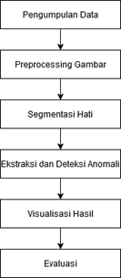

Metodologi yang digunakan dalam proyek ini mencakup beberapa tahapan berikut:

1. Pengumpulan Data: Gambar input diimpor dalam format digital menggunakan pustaka OpenCV. Citra input harus berupa citra medis hati yang relevan.
2. Preprocessing Gambar:
   - Konversi gambar ke skala abu-abu (grayscale).
   - Equalisasi histogram untuk meningkatkan kontras.
   - Gaussian blur untuk mengurangi noise dan artefak.

3. Segmentasi Hati:
   - Menggunakan adaptive thresholding (Gaussian) untuk membedakan area hati dari latar belakang.
   - Operasi morfologi (closing) untuk menghilangkan noise kecil dan menyempurnakan batas area hati.

4. Ekstraksi dan Deteksi Anomali:
   - Deteksi kontur area hati yang tersegmentasi.
   - Memfilter area kecil yang tidak signifikan untuk menghindari deteksi palsu.
   - Menyoroti area mencurigakan pada gambar asli dengan kontur berwarna.

5. Visualisasi Hasil: Menampilkan gambar input, hasil preprocessing, segmentasi, dan deteksi pada satu kanvas menggunakan Matplotlib untuk evaluasi.

6. Evaluasi: Menilai hasil segmentasi dan deteksi dengan membandingkannya terhadap ground truth jika tersedia.

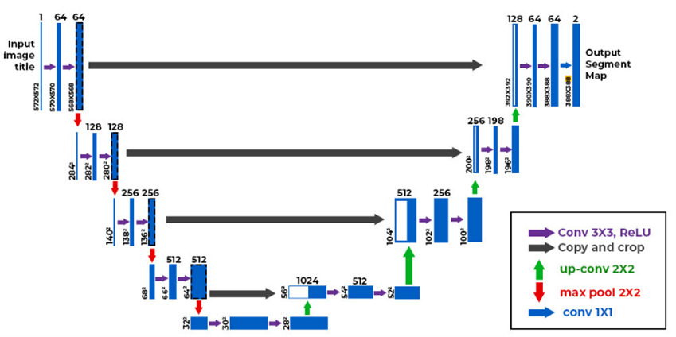

---

## **3. Hasil**
1. Eksperimen Pertama: Pra-pemrosesan Citra
Eksperimen pertama berfokus pada pra-pemrosesan citra, termasuk konversi ke grayscale, normalisasi, dan augmentasi citra untuk meningkatkan kualitas input sebelum masuk ke model.
Visualisasi Hasil:
•	Citra asli dan hasil konversi ke grayscale.
 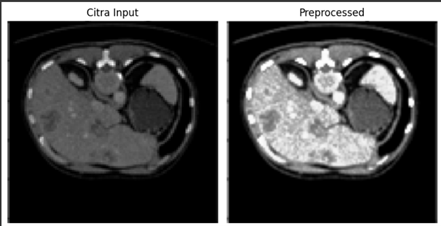.
•	Citra setelah normalisasi dan augmentasi.
  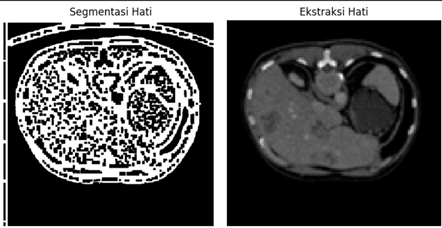.

2. Eksperimen Kedua: Segmentasi Citra menggunakan U-Net
Pada eksperimen ini, model U-Net digunakan untuk melakukan segmentasi pada citra. Model dilatih menggunakan gambar berukuran 256x256 piksel dengan mask ground truth. Setelah proses pelatihan selama 10 epoch, model menghasilkan segmentasi yang cukup akurat.
Visualisasi Hasil:
•	Gambar Asli: Menampilkan citra asli yang digunakan sebagai input model.
  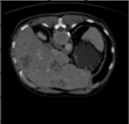.
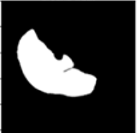.
•	Mask Ground Truth: Menunjukkan label segmentasi asli dari dataset.
 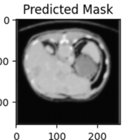.
•	Mask Hasil Prediksi: Mask yang dihasilkan oleh model setelah proses pelatihan.
    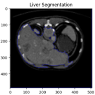.
3. Eksperimen Ketiga: Segmentasi Liver menggunakan Metode Watershed
Eksperimen ini menggunakan metode Watershed untuk melakukan segmentasi liver dari citra medis. Metode ini bekerja dengan menerapkan thresholding Otsu, morfologi opening, serta transformasi jarak untuk memisahkan objek dengan latar belakang.
Visualisasi Hasil:
•	Citra asli dengan hasil segmentasi yang ditandai batas merah.
   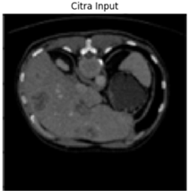.
    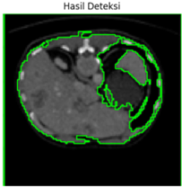.
•	Mask segmentasi yang menunjukkan area liver yang telah dipisahkan.
 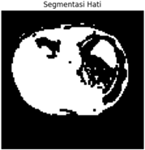.
5. Eksperimen Keempat: Deteksi Tepi menggunakan Canny
Pada eksperimen ini, metode Canny digunakan untuk mengekstrak tepi dari citra. Dengan menggunakan parameter threshold yang disesuaikan, hasil deteksi tepi dapat meningkatkan pemahaman struktur objek dalam gambar.
Visualisasi Hasil:
•	Citra asli.
.
•	Citra hasil deteksi tepi dengan filter Canny.
 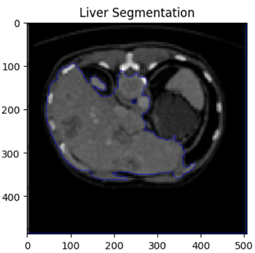.

Hasil eksperimen menunjukkan bahwa model U-Net mampu memberikan segmentasi yang cukup akurat, sedangkan metode Watershed dapat digunakan untuk segmentasi berbasis fitur dengan hasil yang baik. Selain itu, metode Canny memberikan representasi tepi yang berguna untuk analisis lebih lanjut.

---

## **4. Kesimpulan**
Berdasarkan eksperimen yang dilakukan, ditemukan bahwa pra-pemrosesan citra dapat meningkatkan kualitas input untuk model, yang berpengaruh pada hasil segmentasi yang lebih baik. Model U-Net mampu memberikan hasil segmentasi yang cukup akurat setelah proses pelatihan, sedangkan metode Watershed terbukti efektif untuk segmentasi berbasis fitur, terutama pada citra medis. Selain itu, metode deteksi tepi Canny memberikan representasi struktur citra yang berguna untuk analisis lebih lanjut.

Namun, terdapat beberapa batasan dalam eksperimen ini. Model U-Net memerlukan dataset yang lebih besar dan pelatihan lebih lama agar dapat mencapai akurasi optimal. Metode Watershed dapat mengalami kesulitan dalam segmentasi citra dengan kontras rendah, yang dapat mempengaruhi keakuratan hasil segmentasi. Sementara itu, metode Canny memerlukan penyetelan parameter yang dilakukan secara manual agar dapat memberikan hasil yang optimal.

Untuk penelitian dan pengembangan di masa depan, disarankan untuk menggunakan dataset yang lebih besar dan lebih beragam guna meningkatkan performa model. Selain itu, metode segmentasi berbasis pembelajaran mendalam yang lebih kompleks dapat dikembangkan untuk mendapatkan hasil yang lebih akurat. Menggabungkan beberapa teknik segmentasi juga dapat menjadi solusi untuk meningkatkan ketahanan terhadap variasi citra. Terakhir, pengoptimalan parameter secara otomatis untuk metode deteksi tepi dapat meningkatkan efisiensi dalam analisis citra.

---

## **5. Referensi**
- Amrullah, N. (n.d.). KINERJA METODE ALGORITMA FUZZY C-MEANS CLUSTERING UNTUK DETEKSI PENYAKIT LIVER.
- Brattain, L. J., Ozturk, A., Telfer, B. A., Dhyani, M., Grajo, J. R., & Samir, A. E. (2020). Image Processing Pipeline for Liver Fibrosis Classification Using Ultrasound Shear Wave Elastography. Ultrasound in Medicine & Biology, 46(10), 2667–2676. https://doi.org/10.1016/j.ultrasmedbio.2020.05.016
- Kumar V, Dr. S. (2023). Early Stage Liver Disease Prediction using Image Processing. International Journal for Research in Applied Science and Engineering Technology, 11(5), 7397–7405. https://doi.org/10.22214/ijraset.2023.52972
- Saravanan, M. S., Prasad, S. R. K., & Dhanalakshmi, S. (2024). Liver Disease Prediction using various Image Processing Techniques and Machine Learning Algorithms. 2024 First International Conference on Software, Systems and Information Technology (SSITCON), 1–6. https://doi.org/10.1109/SSITCON62437.2024.10796103
- Yuan, E., Ye, Z., & Song, B. (2022). Imaging-based deep learning in liver diseases. Chinese Medical Journal, 135(11), 1325–1327. https://doi.org/10.1097/CM9.0000000000002199
 

---
